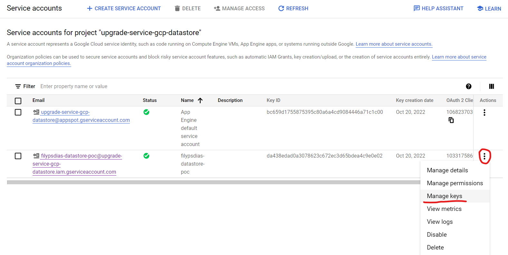

<!-- PROJECT LOGO -->
 

  

  <h3 align="center">Datastore Spring Boot Integration</h3>

  

    Spring Boot & Datastore Integration
     
    <a href="https://cloud.google.com/datastore"><strong>Explore the docs »</strong></a>
     
     
  

<!-- TABLE OF CONTENTS -->

  
Table of Contents

  <ol>
    <li>
      <a href="#about-the-project">About The Project</a>
    </li>
    <li>
      <a href="#getting-started">Getting Started</a>
    </li>
  </ol>

<!-- ABOUT THE PROJECT -->
## Google Cloud Personal Account

In order to integrate a Spring Boot application with a Datastore database, it's necessary to setup an account on Google Cloud Platform. For that, follow those steps:
1. Go to [Google Cloud Console](https://console.cloud.google.com/)
2. Add a Billing account [here](https://console.cloud.google.com/billing)

After the account is already set, let's configure a new project:
1. On the top part of the page, click on the dropdown and on new project button:

 

    
  

2. Select a Project Name and hit the Create button

 

    
  

3. After the project is created, select it!

 

    
  

4. Click on Datastore and Select **DATASTORE MODE**

 

    
  

(<a href="#top">back to top</a>)

<!-- GETTING STARTED -->
## Service Accounts

1. In order to setup the credentials JSON for using the application, go to IAM -> Service Accounts

 

    
  

2. Click on Create Service Account

 

    
  

3. Select the Service Account Name and Assign the Rule as **Datastore Editor**

4. Back on the main page, go to Manage Keys option

 

    
  

5. Add a new Key and select JSON type. The Download will happen automatically. 

 

    
  

6. In order to use that in your Spring Boot application, use as a Environment Variable with the name of GOOGLE_APPLICATION_CREDENTIALS (the value should be the location of this file).

PS: **Remember to don't commit this file. This is a private key**
